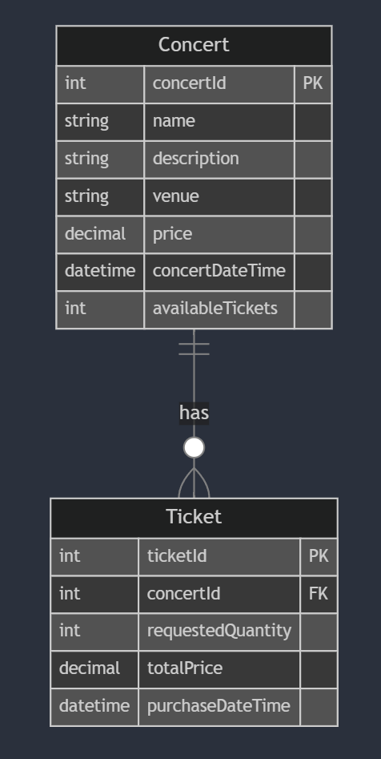

# Full Stack Concert Ticket Web App

## Features
- Responsive frontend
- Two Content Management Systems (CMS) for both technical (admin) and non-technical users:
  - Strapi Admin Panel -> manage API permissions and backend data
  - Google Sheets -> for easy concert/ event management
- Real-time update and synchronization across the frontend, Strapi backend and Google Sheets

## Tech Stack
- Frontend: React and shadcn/Tailwind CSS
- Backend: Strapi (w/ SQLite)

- Testing: Postman and ngrok

## Run the App (for Windows)
1. Install [node.js](https://nodejs.org/en) 
2. Run the local Strapi server with ``` npm run develop ```
3. Open the Strapi CMS with the given localhost url
4. Install [ngrok](https://ngrok.com/) and set a path for the environment variables
5. Create a ngrok account on the website and add your API key ```ngrok config add-authtoken your-api-key```
6. Expose the localhost to the public by ```ngrok http 1337```
7. Create a google account and go to [Google Sheets](https://docs.google.com/spreadsheets/)

## Workflow
### 1. Setting up a Strapi Environment as the Admin-side CMS
- 1.1 Define the data models (Concert, Ticket) with the Content-Type Builder in Strapi CMS

<div style="text-align: center;">
  
</div>

- 1.2 Create a controller to handle the ticket booking logic (e.g. update tickets availability, etc.)

```
Preconditions:
1. Fetch concertID
2. Check if the current time is before the concert date
3. Check if enough tickets are available

Executions:
4. Calculate the total price
5. Create the ticket
6. Update the concert's available tickets
```

- 1.3 Setup a route to connect the controller to the API endpoints and tested with Postman

### 2. Integrating Google Sheets as the User-side CMS
- 2.1 Write a Google Apps Script to sync Google Sheets with Strapi and perform real-time CRUD operations (i.e. when the spreadsheet is on editing)
- 2.2 Setup a installable trigger to enable script automation for external API calls (to Strapi)
- 2.3 Create a tunnel to expose the local Strapi server to the internet using ngrok for testing
> *the script should be running in Google's server*

### 3. Building the Frontend
- 3.1 Import and customize the shadcn components through the shadcn CLI ```npx shadcn@latest add card```
- 3.2 Create a home page with concert info cards in grid layout and popups for the purchasing stage
- 3.3 Integrate state management with React hooks
- 3.4 Integrate API calls using Fetch

#### File Structure for the Frontend:
```
frontend/src/
          ├── components/
          │   ├── CardGrid.jsx
          │   ├── InfoCard.jsx
          │   └── Modal.jsx // ticket booking popup
          ├── pages/
          │   └── Home.jsx
          ├── services/
          │   └── api.js
          ├── App.jsx
          ├── index.css    // only one global css file for Tailwind
          └── main.jsx
```

### 4. Synchronize the Frontend with Google Sheets CMS
- 4.1 Update the Google Apps Script to allow Google Sheets receiving an API call from the Strapi server when a purchase is made at the frontend

<!-- ## Improvement
### Data Models
- add user auth
- add a booking period
- add seat preferences and different ticket price point -->