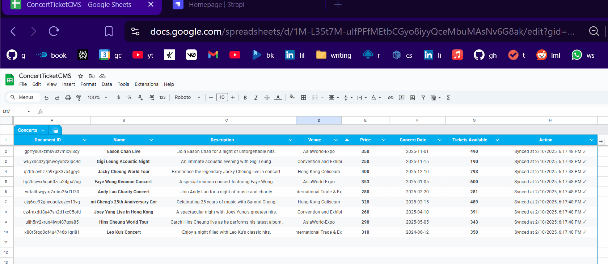
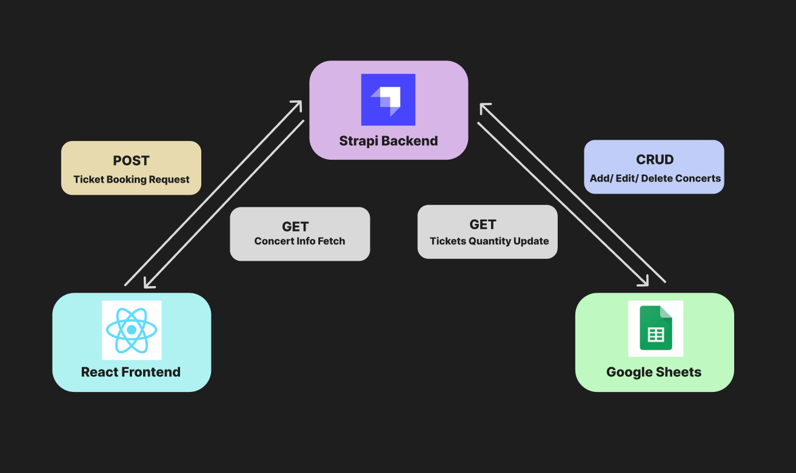

# Full Stack Concert Ticket Web App
Full stack concert ticketing app with dual CMS (Strapi + Google Sheets)

## ✨ Features
- Responsive frontend


- Two Content Management Systems (CMS) for both technical (admin) and non-technical users:
  - Strapi Admin Panel -> manage API permissions and backend data
  - Google Sheets -> for easy concert/ event management


  
- Real-time update and synchronization across the frontend, Strapi backend and Google Sheets



## 📚 Content
- [Tech Stack](#-tech-stack)
- [Run the App](#-run-the-app)
- [Workflow](#-workflow)
- [Improvement](#-improvement)
- [Resources](#-resources)

## 🛠️ Tech Stack
- Frontend: React and shadcn/Tailwind CSS
- Backend: Strapi (w/ SQLite)

- Testing: Postman, ngrok and Vite

## ▶️ Run the App

### I. Strapi CMS
1. Install [node.js](https://nodejs.org/en)
2. Initialize the Strapi dependencies by running the following command:
```
cd backend
npm install
```
3. Create a .env file with  ```touch .env``` and simply copy the content in [.env.example](backend/.env.example) and paste to it
4. Run the local server with ```npm run develop``` and create an Strapi account in the admin panel
5. Install and get your API key from [ngrok](https://ngrok.com/) and set a path for the environment variables
6. Open a separate terminal for the ngrok tunnel and run the following command:
```
cd backend
ngrok config add-authtoken your-api-key
ngrok http 1337
```

### II. Google Sheets CMS
7. Go to [Google Sheets](https://docs.google.com/spreadsheets/) and import [ConcertTicketCMS.xlsx](google-sheets-cms/ConcertTicketCMS.xlsx)
8. Go to ```Extensions -> Apps Script -> Editor``` and paste [StrapiSync.js](google-sheets-cms/StrapiSync.js)
9. Go to ```Extensions -> Apps Script -> Trigger``` and setup two triggers: ```fetchLatestTicketAvailability with On Open``` and ```myOnEdit with On Edit```
9. Go back to ```Strapi Admin Panel -> Settings -> API Tokens``` to generate an API token with full access
10. Paste the API key and ngrok URL in StrapiSync.js


### III. Frontend
11. Setup the frontend by running the following command in a separate terminal:
```
cd frontend
npm install
npm run dev
```

## ⚙️ Workflow
### 1. Setting up a Strapi Environment as the Admin-side CMS
- 1.1 Define the data models (Concert, Ticket) with the Content-Type Builder in Strapi CMS


- 1.2 Create a controller to handle the ticket booking logic (e.g. update tickets availability, etc.)

```
Preconditions:
1. Fetch concert info by documentId
2. Check if the current time is before the concert date
3. Check if enough tickets are available

Executions:
4. Calculate the total price
5. Create the ticket
6. Update the concert's available tickets
```

- 1.3 Setup a route to connect the controller to the API endpoints and test with Postman

### 2. Integrating Google Sheets as the User-side CMS
- 2.1 Write a Google Apps Script to integrate two features using API calls:
  - i. Perform real-time CRUD operations (i.e. when the spreadsheet is on editing) from Sheets to Strapi 
  - ii. Fetch ticket quantity updates from Strapi to Sheets
- 2.2 Setup installable triggers to enable script automation for external API calls
- 2.3 Create a tunnel to expose the local Strapi server to the internet using ngrok for testing
> *the script should be running in Google's server*

### 3. Building the Frontend
- 3.1 Import the shadcn components through the shadcn CLI ```npx shadcn@latest add card dialog button input```
- 3.2 Create the components and the home page and manage the states with state hooks
- 3.3 Integrate API calls using Fetch and effect hooks

#### File Structure for the Frontend:
```
frontend/src
          ├── components
          │   ├── ui                  // shadcn components
          │   │   ├── button.jsx
          │   │   ├── card.jsx
          │   │   ├── dialog.jsx
          │   │   └── input.jsx       // quantity input
          │   ├── ConcertCard.jsx
          │   ├── ConcertGrid.jsx     // grid layout
          │   └── PurchaseDialog.jsx  // purchase popup
          ├── lib
          │   └── utils.js
          ├── testing
          │   └──dummyConcerts.js     // for testing
          ├── App.jsx
          ├── index.css               // tailwind & shadcn setup
          └── main.jsx
```

## 🚀 Improvement
### UX
- Add search bar & filter
- Enhance error handling
- Add loading screen

### Data Models
- Add user authentication
- Add a booking period
- Add seat preferences and different ticket price point

### Performance
- Use webhooks for real-time API calling

### Security
- Enhance API token handling and authorization

## 🔗 Resources
- [shadcn theme generator](https://zippystarter.com/tools/shadcn-ui-theme-generator)
